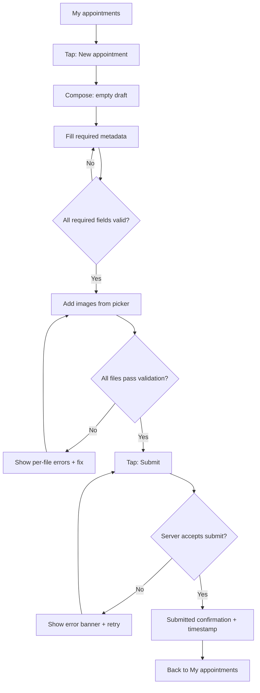
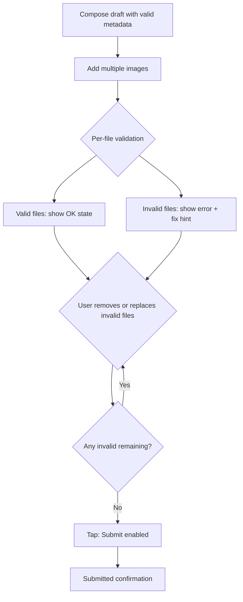
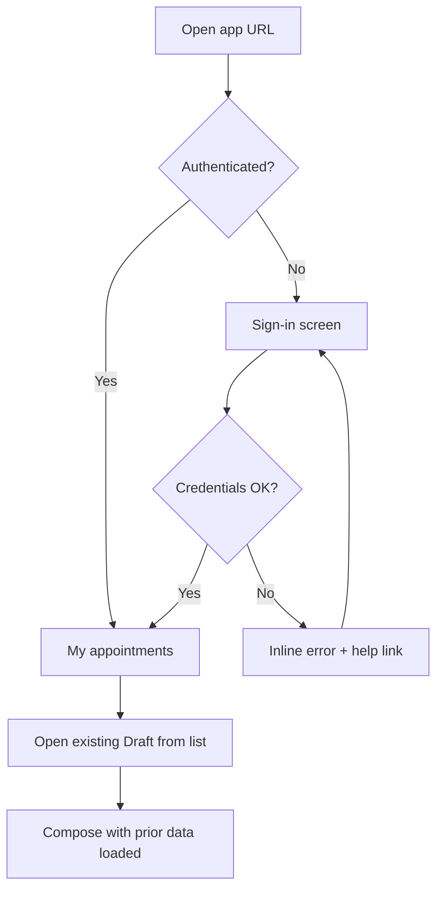

---
stepsCompleted:
  - 1
  - 2
  - 3
  - 4
  - 5
  - 6
  - 7
  - 8
  - 9
  - 10
  - 11
  - 12
  - 13
  - 14
lastStep: 14
workflowComplete: true
inputDocuments:
  - _bmad-output/planning-artifacts/prd.md
  - _bmad-output/planning-artifacts/product-brief-schoolCronicle.md
---

# UX Design Specification schoolCronicle

**Author:** Rudolfgroetz
**Date:** 2026-04-21

---

<!-- UX design content will be appended sequentially through collaborative workflow steps -->

## Executive Summary

### Project Vision

SchoolCronicle V1 helps teachers submit yearly chronicle material through a **single, guided web experience**: structured appointments, validated images, and explicit **draft** vs **submitted** states, producing export-ready data for downstream chronicle production. The UX embodies **quality at the point of entry**—reducing coordinator rework by making invalid or incomplete submissions hard to accidentally ship.

### Target Users

- **Teachers:** Primary actors; varied digital confidence; heavy use of **mobile browsers** after school events, plus desktop during planning time. They need speed, clarity, and forgiveness when uploads fail.
- **Chronicle coordinator (Doris):** Primary beneficiary of cleaner inputs; **not a V1 in-app user**—design should still reflect her needs in labels, required fields, and export semantics teachers see.
- **School privacy/support:** Mostly **off-product**; in-product surfaces are **short paths to help and privacy contacts**, aligned with GDPR expectations.

### Key Design Challenges

- **Mobile-first complex forms:** Required appointment metadata, multi-image attach/remove, and submit—without losing context or primary actions on narrow viewports.
- **Validation-heavy flows:** Per-file and per-field errors must be **scannable**, **actionable**, and **non-accusatory** so rushed users recover without calling IT or Doris.
- **Trust with photos:** Communicate **why** metadata or attestations matter in minimal, plain language; avoid dark patterns while meeting school and GDPR needs.

### Design Opportunities

- **Inline “fix recipes”** for media failures (format, size) paired with **keep good files** behavior to reward partial success.
- **Submission confidence:** Obvious submitted state with **timestamp** and “what Doris gets” mental model (no jargon).
- **Accessibility as default:** Core flows meet **WCAG 2.2 AA** targets so teachers using zoom, voice control, or keyboard are not second-class.

## Core User Experience

### Defining Experience

The core experience is **“log chronicle-ready moments in one sitting”**: a teacher opens **New appointment**, completes **required chronicle metadata**, adds **images that pass rules**, and moves the record from **Draft** to **Submitted** with **immediate, unambiguous confirmation**. Secondary but essential: **recover** from failed files without starting over.

### Platform Strategy

- **V1:** Responsive **web** only (mobile browser parity with desktop for core flows); **no native apps**, **no offline-first** requirement; assume intermittent connectivity with clear handling of failed saves/uploads.
- **Input modes:** **Touch-first** layouts with **keyboard** operability for forms; file input must work with **camera/gallery** where the OS/browser allows.
- **Constraints:** No admin UI—teachers never manage school configuration in-product; copy should not imply hidden settings they cannot reach.

### Effortless Interactions

- **Seeing what’s required** before typing (labels, examples, optional vs required).
- **Knowing draft vs submitted** at a glance from list and detail views.
- **Replacing only bad files** while keeping good ones and form text intact.
- **Single primary action** on the compose screen (Save draft vs Submit) with disabled Submit explained inline when blocked.

### Critical Success Moments

- **First successful submit:** Clear **Submitted** state + timestamp; user trusts nothing else is needed for Doris.
- **First recovery from upload errors:** User fixes files and submits **without** email or phone support.
- **First mobile use after an event:** One-thumb path to attach photos and submit before leaving the building.

### Experience Principles

1. **Clarity over cleverness** — plain language, obvious states, no mystery meat navigation.
2. **Validate in place** — errors next to fields and files; never a generic “something went wrong” for fixable issues.
3. **Mobile is not a shrink-ray** — prioritize content and actions; defer nice-to-have density to desktop.
4. **Trust by transparency** — short, honest explanations for anything touching photos or privacy; no nagging beyond what policy requires.
5. **Respect time** — minimize steps to a valid submit; preserve work automatically where possible.

## Desired Emotional Response

### Primary Emotional Goals

- **Relieved and unburdened** — “This is off my plate and done right.”
- **In control** — always know what state the entry is in and what one action closes the loop.
- **Trusted** — especially around photos and school use; the app explains only what matters, without legal theater on every screen.

### Emotional Journey Mapping

- **First visit / sign-in:** Welcoming, **school-appropriate**, not consumer-glossy; low cognitive load.
- **During compose:** Focused and **supported**; required fields feel fair because the “why” is one line away.
- **On validation errors:** **Calm problem-solving**, not blame—clear next steps, preserved work.
- **After submit:** **Closure** — pride-lite accomplishment (“submitted, timestamped, nothing else required”).
- **When something goes wrong (network, session):** **Honest and recoverable** — what happened, what to do, no dead ends.
- **Return use:** **Familiar** — list and filters feel stable; muscle memory builds across the year.

### Micro-Emotions

- Prioritize **confidence** over cleverness; avoid **confusion** from hidden draft state or buried errors.
- Prefer **trust** over **skepticism** on privacy copy—short, specific, human.
- After errors, aim for **determination** (I can fix this) not **shame** (I broke something).
- Aim for **satisfaction** over hype “delight” except small moments (e.g., all checks green, submit enabled).

### Design Implications

- **Relief** → obvious **Draft / Submitted** badges, autosave or explicit save feedback, no duplicate coordinator steps implied in copy.
- **Control** → sticky primary actions on mobile, predictable navigation between list ↔ detail ↔ edit.
- **Trust** → privacy and photo-use language in **plain language** (match product locale) at the **minimum** touchpoints (upload, submit, help).
- **Calm errors** → neutral tone, **per-item** remediation, never red-wall-of-text; success path still visible.
- **Closure** → post-submit screen states success in **one scan** (title, time, “submitted”, link back to list).

### Emotional Design Principles

1. **Never scold the teacher** — errors are **facts + fixes**, not character judgments.
2. **Earn trust with restraint** — fewer modals; only interrupt for irreversible or compliance-critical moments.
3. **Celebrate completion quietly** — clear confirmation, no confetti unless the school brand asks for it later.
4. **Emotion follows clarity** — if information architecture is right, positive feelings follow without gimmicks.

## UX Pattern Analysis & Inspiration

### Inspiring Products Analysis

**Stand-in references (replace with your school’s real tools if needed):**

- **Simple survey / form products (e.g. Google Forms–class flows):** Clear required-field affordances, linear progress, and a single obvious submit. Lesson: **reduce configuration**; one primary path beats clever branching for occasional users.

- **Workplace file hubs (e.g. OneDrive / Google Drive–class uploads):** Per-file status, retry, and recognizable file rows. Lesson: **treat each image as a first-class row** with name, size, state, and remove/replace.

- **Mobile OS pickers (Photos / Files–class patterns):** Native selection, multi-select, and return to app with a stable draft. Lesson: **defer to platform pickers** where possible; keep the app state resilient when users bounce in and out.

### Transferable UX Patterns

- **Master–detail with persistent draft** — list of appointments + compose/detail; draft survives navigation where the product allows it (per FRs).
- **Inline validation with “enable submit” gating** — Submit disabled with **one line** explaining what’s missing (fields or files).
- **Per-asset error rows** — failed uploads stay visible with **one fix action** each (replace, remove, compress guidance).
- **Post-commit confirmation card** — title, state, timestamp, next step (“Back to list”, “Add another”) for closure.
- **Sticky footer or sticky primary bar on mobile** — Save draft / Submit always reachable without hunting past the keyboard.

### Anti-Patterns to Avoid

- **Mystery validation** — submit fails with a toast only; user scroll-hunts for the field.
- **All-or-nothing uploads** — one bad file clears the batch or the form.
- **Legal walls before value** — long GDPR text before the user sees the task (use **minimal, timed** disclosures at upload/submit instead).
- **Ambiguous state names** — “Pending”, “Processing” without mapping to **Draft** vs **Submitted** mental models.
- **Consumer-style empty states** — jokey copy that clashes with a **professional school** tone.

### Design Inspiration Strategy

- **Adopt:** Per-file upload rows; disabled submit with inline reason; obvious draft/submitted badges; calm error copy (from emotional principles).
- **Adapt:** “Enterprise” file hub density **down** for teachers—fewer columns, bigger tap targets, school-appropriate tone.
- **Avoid:** Feature-heavy dashboards, admin affordances in V1, gamification that trivializes compliance or chronicle work.

## Design System Foundation

### 1.1 Design System Choice

**Angular Material** (with Angular CDK primitives where needed) as the primary UI foundation, supplemented by **small custom components** only where chronicle-specific patterns demand it (e.g. per-image upload row, appointment state badge).

### Rationale for Selection

- **Stack fit:** The implementation stack is **Angular**; Material is the **first-party-aligned** component set with mature patterns for forms, layout, navigation shell, dialogs, and progress indicators.
- **Speed vs. differentiation:** V1 optimizes for **predictable delivery and accessibility defaults** over a bespoke visual brand; Material accelerates that while remaining **themeable** (color, typography, density).
- **Accessibility:** Strong baseline for focus management, ARIA patterns, and keyboard support on standard components—aligned with WCAG-oriented NFRs (exact conformance still verified per screen).
- **Maintenance:** Large community, stable upgrades alongside Angular versions, fewer one-off UI bugs than a fully custom system for a small team.

### Implementation Approach

- Scaffold screens with **Material layout** (toolbar / sidenav or top app bar pattern TBD in UX refinement), **MatFormField** patterns for appointment metadata, **tables or card lists** for appointments, **buttons** for primary/secondary actions, **snack-bar** or inline banners for global errors, **dialog** for destructive or compliance-critical confirmations only.
- Use **CDK** for behaviors that Material does not cover out of the box (e.g. drag-drop only if required later; file list as custom list with Material list item styling).
- Define a **small set of app-specific patterns** (draft badge, submitted badge, file row states) as documented wrappers so visual and behavior stay consistent.

### Customization Strategy

- **Theming:** School or product **primary/secondary palette**, neutral surfaces, and **high-contrast** focus rings; respect **prefers-reduced-motion** for non-essential animation.
- **Density:** Prefer **comfortable** touch spacing on mobile; slightly denser tables on desktop where it aids scanning.
- **Typography:** Legible system or webfont stack; clear hierarchy (page title, section, field label, helper, error).
- **Copy and tone:** Professional, calm, non-jokey; align with emotional design principles—not dictated by Material defaults alone.
- **Brand divergence:** If the school later requires a stronger brand layer, evaluate **partial** custom components or an additional token layer without replacing the whole system in V1.

## 2. Core User Experience

### 2.1 Defining Experience

The defining experience teachers will describe in one sentence: **“I logged the event, attached photos that actually went through, hit submit, and it was really done—no chasing, no wrong format.”** If that loop is excellent, Doris’s downstream work and school trust follow naturally.

### 2.2 User Mental Model

Teachers today solve this with **email, chat, camera rolls, and ad hoc folders**—high variance, low structure. They bring a **“school form + attachments”** mental model: required fields should feel **official but fair**, attachments should behave like **known-good files**, and **submit** should mean **handoff to the chronicle process**, not “send and hope.” Confusion spikes when **state is unclear** (draft vs sent) or when **one bad file punishes the whole batch**.

### 2.3 Success Criteria

- **“It just works” moment:** Submit succeeds on the **first try** when the teacher followed visible rules; if blocked, they always see **what remains** in one place.
- **Accomplishment:** Submitted confirmation answers **“Am I finished?”** without reading fine print—title, **Submitted**, timestamp, optional short line that the entry is chronicle-ready.
- **Right feedback:** Field errors sit **on the field**; file errors sit **on the file row**; global issues use a **single calm banner** with retry where relevant.
- **Speed perception:** Core path feels **continuous**—minimal page reloads interrupting flow; uploads show **progress** so waits feel intentional.

### 2.4 Novel UX Patterns

**Mostly established patterns** (master–detail list, form + attachment list, gated submit). The **distinctive combination** is **chronicle-specific validation**, **draft/submitted contract**, and **school-appropriate calm tone** in one product—**not** a novel gesture or new metaphor. Education: use **familiar list + form + file row** patterns; innovate only inside **wording and validation clarity**, not navigation novelty.

### 2.5 Experience Mechanics

**1. Initiation**

- From **My appointments**, a **primary** control starts **New appointment** (label explicit: e.g. “New appointment” / “Add chronicle entry”).
- Optional: empty-state guidance when the list has no drafts yet.

**2. Interaction**

- **Compose** combines **metadata fields** (required first or visually prioritized) and **image list** (add, preview thumbnail if feasible, remove, per-file status).
- **Save draft** persists work without implying chronicle handoff; **Submit** runs final validation then commits to **Submitted** if all gates pass.

**3. Feedback**

- **Inline:** required markers, helper text, field-level errors; file rows show **queued / uploading / valid / invalid** with fix hints.
- **Submit blocked:** primary button disabled plus **one summary line** listing blockers (missing fields count, invalid files count) with anchors or scroll-into-view to each issue.

**4. Completion**

- **Success view:** clear **Submitted** state, **timestamp**, entry title/type, actions **Back to list** and **Add another**.
- **Failure (network/server):** non-destructive message, **retry** where safe, **draft preserved**—never silent data loss.

## Visual Design Foundation

### Color System

- **Approach:** Start from **Angular Material theming** with **semantic roles**: `primary` (main actions, key links), `secondary` or `tertiary` (supporting accents), `surface` / `background`, `error`, `warning`, `success` (validation and state—not playful candy colors).
- **Default direction (placeholder until brand):** **Cool neutral surfaces** with a **single restrained primary** (e.g. deep blue or teal) that reads **institutional and calm**, not startup-neon.
- **State colors:** Draft = **neutral outline** badge; Submitted = **success** semantic (muted green or primary-dark check), aligned with Material state patterns; errors use **error** role with **non-screaming** saturation where Material allows tuning.
- **Contrast:** Meet **WCAG 2.2 AA** for body text and UI controls on default theme; verify **focus rings** and **disabled** states remain visible on real devices.

### Typography System

- **Tone:** **Professional, readable, low-decoration**—optimized for **forms, labels, and short help text**, not long articles.
- **Stack:** Prefer **system UI fonts** or a **single webfont** with reliable Latin (and school locale) coverage; avoid decorative display faces for V1.
- **Scale:** Material-typographic levels (e.g. headline / title / subtitle / body / caption) mapped to: **page title**, **section**, **field label**, **helper**, **error**, **metadata** on cards.
- **Rules:** **Minimum 16px** body on mobile where feasible; line-height comfortable for multi-line helper and error text; **no all-caps** for long labels.

### Spacing & Layout Foundation

- **Base unit:** **8px grid** (4px for fine tuning only)—consistent with Material spacing tokens.
- **Density:** **Comfortable** on mobile (generous vertical rhythm between fields and file rows); slightly **tighter** list rows on desktop if scan speed matters.
- **Layout:** **Single-column** compose on narrow viewports; optional **two-column** (meta left, images right) from **md** breakpoint upward if it reduces scroll without hiding actions.
- **Chrome:** Minimal top app bar; **primary actions** in **sticky footer or bar** on compose screens so thumb reach is predictable.

### Accessibility Considerations

- **Color:** Do not rely on color alone for validation—pair with **icon + text** on file rows and fields.
- **Motion:** Honor **`prefers-reduced-motion`**; keep transitions functional, not decorative.
- **Focus:** Visible focus for keyboard and hybrid users; logical tab order through form then file actions then primary buttons.
- **Touch:** Minimum **44×44px** touch targets for primary controls and destructive actions (with confirmation).

## Design Direction Decision

### Design Directions Explored

Four directions are captured in **`ux-design-directions.html`** (open locally in a browser):

| ID | Summary |
|----|--------|
| **A** | Dark blue institutional toolbar; neutral cards; blue primary submit; standard split list + compose. |
| **B** | Light chrome; warmer surfaces; orange/umber primary; softer draft badge. |
| **C** | Dark slate chrome; denser list rows; teal primary; efficiency-first desktop feel. |
| **D** | Narrow single-column compose; sticky bottom actions; indigo primary; mobile-first. |

### Chosen Direction

**Direction A (Institutional calm)** — default selection; aligns with calm, professional school context and Angular Material theming.

### Design Rationale

- Best alignment with **emotional goals** (calm, trusted, professional) and **visual foundation** (cool neutral + restrained primary).
- **Material defaults** map cleanly (toolbar, raised actions, semantic badges).
- **Split list + compose** supports PRD success criteria (fast orientation, draft vs submitted at a glance) on tablet/desktop; **Direction D** patterns can inform **narrow breakpoints** (stacked compose, sticky footer) without replacing the whole shell.

### Implementation Approach

- Implement **Direction A** as the default **Angular Material** theme (custom palette tokens for primary/surface/error).
- Reuse **Direction D** layout ideas under **small breakpoints** (stacked compose, sticky footer) as responsive overrides in detailed UI specs / storyboards.
- Revisit B/C accents only if the school supplies a **warmer brand** or asks for **higher data density**.

## User Journey Flows

Flows build on PRD narratives (Anna / Ben) and FRs: **list → compose → validate → submit**, with **draft persistence** and **per-file recovery**.

### Journey 1 — Teacher: create and submit appointment (happy path)

**Goal:** Move a new chronicle entry from empty draft to **Submitted** with valid metadata and images in one session.

**Flow:** Start from **My appointments** → **New appointment** → fill required fields → add images (all valid) → **Submit** → confirmation → return to list.

### Journey 2 — Teacher: recover from invalid images (edge path)

**Goal:** After bulk pick, **some files fail**; user fixes only bad rows and reaches **Submitted** without losing valid work or retyping metadata.

### Journey 3 — Teacher: sign-in and resume draft (supporting)

**Goal:** Return later; **session valid** → land on list; **session expired** → sign-in → optional **resume last draft** from list.

### Journey Patterns

- **Hub-and-spoke:** **My appointments** is the hub; compose is a **spoke** with a clear **back** affordance.
- **Gated submit:** Submit **disabled** until field + file gates pass; **one summary** of blockers when disabled.
- **Row-scoped errors:** Metadata issues on fields; media issues on **file rows** only.
- **Non-destructive failures:** Network/server errors offer **retry**; **draft** remains unless user discards.

### Flow Optimization Principles

1. **Shortest path to valid submit** — required fields first; optional collapsed; no redundant confirmations.
2. **Preserve investment** — never clear the form on partial upload failure; **Save draft** always visible on compose.
3. **Progressive disclosure** — advanced or legal detail only at **upload** and **submit** touchpoints, not on empty form.
4. **Thumb-safe mobile** — primary actions in **sticky** region; avoid sole reliance on tiny icon-only controls for critical paths.

## Component Strategy

### Design System Components

Use **Angular Material** for:

- **App shell:** `mat-toolbar`, optional `mat-sidenav` or simple header pattern; `mat-icon` for sparse affordances.
- **Lists:** `mat-list` / `mat-nav-list` or `mat-table` for **My appointments** (sort/filter as V1 needs).
- **Forms:** `mat-form-field` with `mat-input`, `mat-select`, `mat-datepicker` (if date control is datepicker), `mat-checkbox` where required; `mat-error` / hint lines.
- **Actions:** `mat-button`, `mat-flat-button`, `mat-stroked-button`; `mat-fab` or prominent flat only if hierarchy needs it.
- **Feedback:** `mat-progress-bar` or `mat-spinner` for uploads; `mat-snack-bar` for transient global errors; `mat-dialog` sparingly for destructive or high-stakes confirmations.
- **Layout:** `mat-card` for grouping compose sections; `mat-divider`.

### Custom Components

#### 1. `AppointmentStatusBadge`

- **Purpose:** Instantly communicate **Draft** vs **Submitted** (and later **Needs fix** if introduced) with color + text, never color alone.
- **Usage:** List rows, compose header, confirmation screen.
- **Anatomy:** Label text + optional icon; pill or outlined chip style aligned with Direction A.
- **States:** draft (neutral), submitted (success semantic), optional disabled/read-only.
- **Accessibility:** Role/text conveys state; sufficient contrast on both themes.

#### 2. `ImageUploadRow`

- **Purpose:** One row per file with **name, size, state**, and actions **Remove** / **Replace**; inline validation message and “how to fix.”
- **Usage:** Compose panel image list.
- **Anatomy:** Thumbnail optional; primary text; secondary meta; trailing actions; optional progress sub-line.
- **States:** queued, uploading, valid, invalid (with error text), removed (animate out per policy).
- **Accessibility:** Each row focusable or actions keyboard reachable; announce state changes for screen readers where practical.

#### 3. `SubmitReadinessSummary`

- **Purpose:** When Submit is disabled, show **one** concise line: e.g. “2 required fields missing · 1 image needs fixing” with **jump links** or scroll targets to each blocker.
- **Usage:** Sticky footer region above primary buttons on compose.
- **States:** hidden when submit enabled; updates live as fields/files change.
- **Accessibility:** `aria-live="polite"` for summary updates (avoid noisy announcements).

#### 4. `AppointmentListItem` (composite)

- **Purpose:** Consistent row/card for list: title, type, date, **status badge**, optional thumbnail count.
- **Usage:** My appointments hub.
- **Built from:** Material list/table cells + `AppointmentStatusBadge` + typography tokens.

### Component Implementation Strategy

- **Token-first:** Custom components consume **Material theme** (color, density, typography) — no one-off hex in templates.
- **Thin wrappers:** Prefer composing Material primitives in **Angular components** with stable APIs (`inputs` for appointment model slice, `outputs` for actions).
- **Testing contract:** Each custom component has **visual states** documented for Storybook-style review (manual OK for V1).

### Implementation Roadmap

**Phase 1 — Ship V1 core flows**

- `AppointmentStatusBadge`, `ImageUploadRow`, `SubmitReadinessSummary`, `AppointmentListItem`
- Material form stack + sticky compose actions + submit confirmation layout

**Phase 2 — Hardening**

- Empty states, skeleton loaders, improved upload retry UX, list filtering/sorting patterns

**Phase 3 — Growth (post-MVP product)**

- Admin shell components (out of V1 scope), bulk upload, richer media — only when PRD expands

## UX Consistency Patterns

### Button Hierarchy

- **One primary per surface:** On compose, **Submit** is primary when enabled; **Save draft** is secondary (stroked or tonal).
- **Destructive:** **Remove** image or discard draft uses text button or icon+text with **confirmation dialog** only for irreversible actions (e.g. discard draft with content).
- **Order:** Primary action **trailing** (LTR) in footer; on mobile, **Submit** remains the right or full-width emphasis per breakpoint rules.

### Feedback Patterns

- **Success (submit):** Dedicated **confirmation** region (not only toast)—toast optional for redundancy.
- **Recoverable errors:** Inline field/file errors first; **snack-bar** for transient server errors with **Retry** when safe.
- **Blocking errors:** Full-width **banner** above sticky actions when session/upload pipeline is broken; never only a disappearing toast.
- **Progress:** Per-file progress on **ImageUploadRow**; optional thin **progress bar** for overall batch when multiple uploads.

### Form Patterns

- **Required fields:** Asterisk or “Required” in label; **mat-error** tied to control; show errors **after** blur or submit attempt, not on every keystroke (configurable: first show on submit attempt for calmer first impression).
- **Helpers:** One line under field; link “Why we ask” only for sensitive fields (e.g. photo attestation).
- **Disabled submit:** Always paired with **`SubmitReadinessSummary`** explaining blockers.

### Navigation Patterns

- **Hub:** **My appointments** default after login; **New appointment** is obvious primary entry.
- **Compose:** Clear **Back** returns to hub with **unsaved changes** guard if draft dirty.
- **Deep links:** V1 may omit; if added later, always land in hub then navigate to target draft with permission check.

### Additional Patterns

- **Empty list:** Short explanation + **New appointment** CTA; link to help for “what counts as an appointment.”
- **Loading list:** Skeleton rows or spinner in list region—not blocking whole app shell.
- **Submitted read-only:** Disable edits; offer **“Add another”** or **“Back to list”**; no misleading edit icons.
- **Privacy touchpoints:** Compact disclosure at **first image add** and/or **submit**; full policy link opens **new tab** or in-app scrollable panel—never blocking entire compose indefinitely.

## Responsive Design & Accessibility

### Responsive Strategy

- **Mobile-first:** Design and test compose and list at **~360px** width first; scale up for tablet/desktop.
- **Desktop / tablet:** From **~960px** (or Material `md`/`lg` equivalents), allow **two-column compose** (metadata + images) when it reduces scroll without hiding sticky actions; list may use **table** layout on wide screens and **cards** on narrow.
- **Touch:** Large tap targets, sticky primary region on compose; avoid hover-only affordances for critical actions.

### Breakpoint Strategy

- Align with **Angular Material / CDK layout utilities** where used; otherwise CSS with these **reference bands**:
  - **Narrow:** < 600px — single column; full-width sticky footer for actions.
  - **Medium:** 600px–959px — optional two-column compose if vertical space allows.
  - **Wide:** ≥ 960px — list + detail side-by-side **only if** it improves scan (otherwise keep stacked for simplicity in V1).

### Accessibility Strategy

- **Target:** **WCAG 2.2 Level AA** for core flows (login, list, compose, upload errors, submit confirmation, read-only submitted view).
- **Contrast:** Text and UI controls meet AA on default theme; re-check when school brand colors are applied.
- **Keyboard:** Full path through form fields, file actions, and primary/secondary buttons; visible focus; logical tab order (no keyboard traps in dialogs).
- **Screen readers:** Meaningful labels on inputs and upload rows; **live region** for `SubmitReadinessSummary` updates (polite); state changes on file rows exposed textually.
- **Motion:** Honor **`prefers-reduced-motion`** for non-essential animation.

### Testing Strategy

- **Responsive:** Physical **iOS Safari** and **Chrome Android** smoke tests; resize desktop browsers; verify sticky actions with on-screen keyboard behavior where applicable.
- **Accessibility:** **axe** or Lighthouse automated scans on key routes; manual **VoiceOver** (iOS) + **NVDA** or **VoiceOver** (macOS) spot checks; full **keyboard-only** pass on compose flow.
- **Regression:** Snapshot or visual checks for **error states** and **submitted read-only** after theme changes.

### Implementation Guidelines

- Prefer **semantic HTML** inside Material templates where possible; add **ARIA** only to close gaps (custom rows, live regions).
- **Focus management:** Move focus to dialog on open and restore on close; on inline errors, consider **focus first invalid** after failed submit (optional product choice—document in implementation).
- **Images:** Meaningful **alt text** policy for thumbnails (filename or user description per product rules); decorative images marked `alt=""`.
- **Units:** Use **rem**/theme spacing tokens; avoid fixed heights that clip enlarged text.
